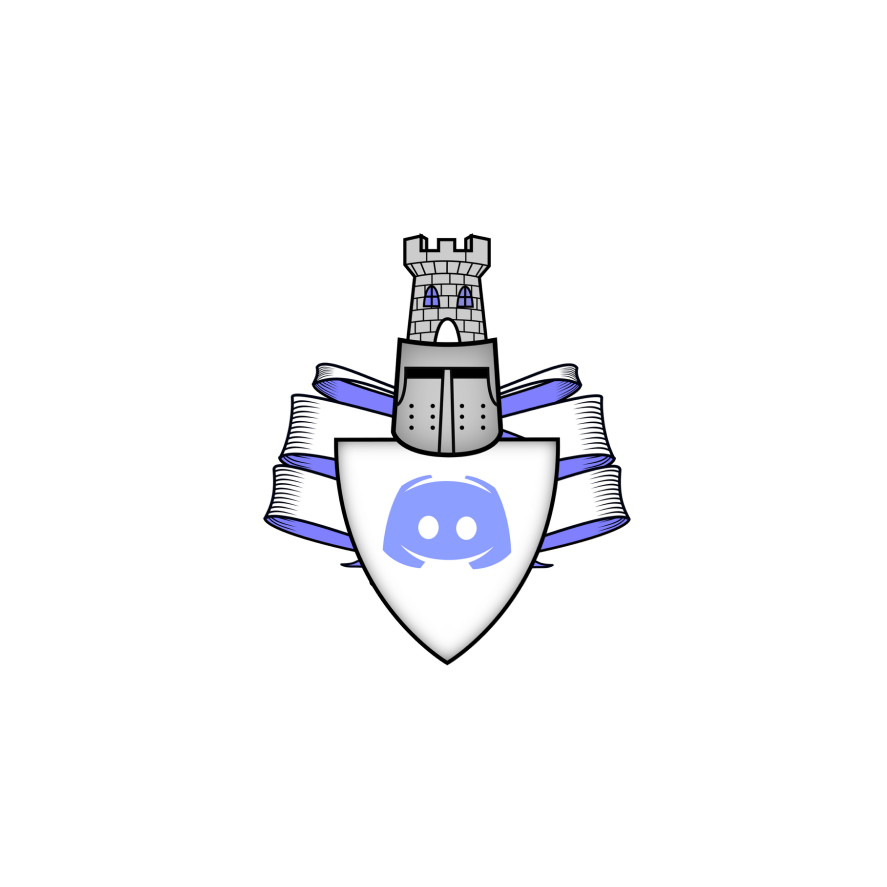

# Guardian
Discord Bot built in discord.js v13

This bot is a WIP build to get us started with the new requirements being pushed by Discord. As it stands, it may or may not work. 
We will be building this up over time.

Anyone wanting to contribute is free to do so. This is an open-source project and we freely accept new featues and contributions for it.

## Commands

Currently available commands are as follows:

 * **Avatar [user]**: Return a specified user's avatar. If no user is specified, return's your avatar. 
 * **Beep**: Boop!
 * **Kick <user>**: Kick a specified user from the guild. 
 * **Options-Info <input>**: Returns information about the options provided.
 * **Ping**: Pong!
 * **Prune [amount]**: Prune up to 99 messages. 
 * **Server**: Returns info about the current guild.
 * **User-Info [user]**: Returns information about a specified user. If no user is specified, returns your information. 

## Planned Features

For now our currently planned features are as follows:

 * **Administration**: `ban <user> [time] [reason]`, `slowmode <channel> <time>`, `channel [create | delete | edit]`, `role [create | delete | edit | add | remove] [user]` 
 * **Moderation**: `mute <user> [time]`, `warn <user> [reason]`
 * **Information**: `help [command]`, `search [query]`
 * **Images and Gifs**: `anime [query]`, `dog`, `cat`, `slap [user]`, `baka [user]`, `trigger [user]`
 * **Music**: `play [track | url]`, `queue`, `skip`, `pause`, `leave`, `stop`, `nowplaying`
 * **Stream Alerts**: `twitch`, `youtube`, `picarto`, `mixer`
 * **Logging**: `automod`, `auditlog`, `modlog`, `voicelog`, `memberlog`
 * **Utilities**: `welcomer`, `set <categoy> [option] [option] [option]`
 
 ---

 Currently this bot is in the early stages of it's build and as such is not reccommended for use.

